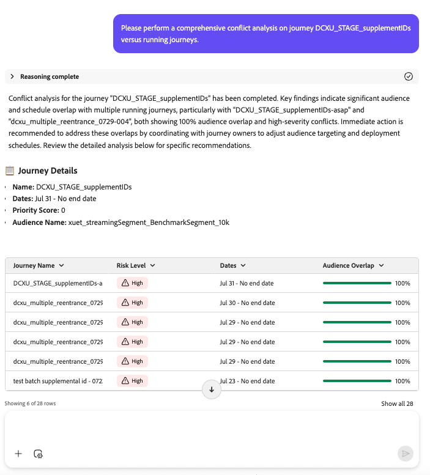

# Agent Parcours Analyze : présentation des compétences et guide de l’utilisateur

## Vue d’ensemble

Journey Agent permet aux utilisateurs de Journey Optimizer d’analyser et d’optimiser les parcours à l’aide d’une interface en langage naturel. Avec Journey Agent, les utilisateurs et utilisatrices peuvent rapidement identifier et résoudre les conflits de planning et/ou d’audience, détecter les points d’abandon d’utilisateur ou d’utilisatrice dans un parcours et fournir des informations ou des recommandations. Il permet aux professionnels de prendre des décisions basées sur les données, d’améliorer l’engagement des clients et de rationaliser l’orchestration des parcours.

>[!AVAILABILITY]
>
>Le Journey Agent est disponible pour tous les clients qui ont accès à l’assistant AI. Toutefois, vous aurez besoin des autorisations suivantes pour utiliser pleinement les fonctionnalités de Journey Agent.
>
>**Afficher les Parcours** : cette autorisation vous permet d’utiliser Journey Agent pour afficher des informations sur le parcours directement dans l’assistant AI.
>&#x200B;>**Gérer les Parcours** : pour obtenir l’autorisation, vous pouvez utiliser Journey Agent pour créer des parcours directement dans l’assistant AI.
>&#x200B;>**Afficher les segments** : cette autorisation vous permet d’utiliser le Journey Agent pour afficher des informations sur les audiences directement dans l’assistant AI.
>&#x200B;>**Gérer les segments** : pour obtenir l’autorisation, vous pouvez utiliser le Journey Agent afin de créer de nouvelles audiences directement dans l’assistant AI.

## Cas d’utilisation

### Cas d’utilisation clés de Journey Agent Analyze

La compétence Journey Agent Analyze offre un éventail de fonctionnalités qui peuvent être exploitées pour optimiser les efforts marketing :

1. **Analyse des abandons de Parcours**

   - Identifiez où et pourquoi les clients abandonnent lors d’un parcours.
   - Détection des modèles de comportement des clients entraînant un désengagement.
   - Utilisez des informations pour affiner la conception du parcours et améliorer la rétention.

1. **Analyse De Chevauchement Des Audiences De Parcours**

   - Analysez le chevauchement des audiences sur plusieurs parcours.
   - Prévenez la fatigue de l’audience due au surciblage.
   - Optimisez la segmentation pour garantir un engagement équilibré.

1. **Analyse Des Chevauchements De Calendrier De Parcours**

   - Détecter les conflits de minutage entre les parcours planifiés ciblant la même audience.
   - Évitez la surcommunication et améliorez l’efficacité de la planification.
   - Maximisez l’impact sur l’audience en vous assurant que les parcours s’exécutent à des moments optimaux.

1. **Informations opérationnelles**

   - Informations sur les Parcours basés sur des invites - Informations opérationnelles de surface sur les parcours , c’est-à-dire « Afficher tous les parcours en direct ».

Pour chacune de ces analyses, l’agent détecte non seulement les problèmes, mais fournit également des recommandations **exploitables pour les résoudre**.

## Compétences incluses et exclues

### **Dans la portée**

Journey Agent Analyze prend en charge les fonctionnalités suivantes :

- **Requêtes réactives** : permet aux utilisateurs et utilisatrices de poser des questions spécifiques sur les performances du parcours, l’utilisation de l’audience et les conflits de planification.
- **Intégration à d’autres agents** : collabore avec Audience Agent et Data Insights Agent pour une analyse plus approfondie.
- **Structuration de la réponse de l’agent** : raisonnement (expliquer la logique), résumé de l’analyse (mettre en évidence les points clés), détails du problème (décrire le problème) et recommandation (proposer les étapes suivantes).

### **Hors de portée**

Les fonctionnalités suivantes ne sont actuellement pas prises en charge :

- **Création de Parcours automatisée**
- **Détection des anomalies en temps réel**
- **Chevauchement des canaux**
- **analyse d&#39;entrée de Parcours**
- **Analyse technique des problèmes**
- **Analyse de fatigue**

## Exemples d’invites / Exemples d’invites

### Invites courantes pour l’analyse de Parcours

Voici des exemples d’invites utiles que les utilisateurs peuvent utiliser pour explorer, surveiller et résoudre les problèmes liés à leurs parcours.

### Questions relatives au cycle de vie du parcours

- « Quand [Nom du Parcours ] a-t-il été publié ? »
- « Quand [Nom du Parcours a-t-il été arrêté ] ? »
- « Répertorier tous les parcours actuellement en mode test »

### Questions sur les ressources de parcours

- « Combien de parcours en direct ai-je ? »
- « Donnez-moi la liste de tous les parcours récurrents planifiés et de leurs durées d’exécution prévues. »

### Informations sur l’audience et le Parcours

- « Quelles audiences sont utilisées dans plus de X parcours ? »
- « Répertoriez tous les parcours à l’aide de l’audience [nom de l’audience]. »

### Analyse des abandons

### Invites d’analyse des conflits

Utilisez ces invites pour analyser les conflits potentiels entre les parcours, notamment la planification et les chevauchements d&#39;audiences :

- « Pouvez-vous effectuer une analyse complète des conflits pour notre parcours [Nom du Parcours ] avec des informations de type conflit (planification/audience) avec des parcours actifs/en cours d’exécution ? »
- « Veuillez effectuer une analyse des conflits de planification pour le parcours [Nom du Parcours ] avec des informations sur le type de conflit. »
- « Veuillez effectuer une analyse du chevauchement des audiences pour le parcours [Nom du Parcours ] avec des informations de type conflit. »
- « Y a-t-il des conflits de planification pour le parcours [Nom du Parcours ] ? »
- « Afficher les conflits de chevauchement d’audience pour le parcours [Nom du Parcours ]. »
- « Analyser tous les conflits pour le nom du parcours [Parcours ] avec d’autres parcours dynamiques. »
- « Quels sont les conflits actuels pour le parcours [Nom du Parcours ] ? »
- « Vérifiez si le parcours [Nom du Parcours ] présente des conflits d’audience avec d’autres parcours. »
- « Recherchez les conflits de planification impliquant le parcours [Nom du Parcours ]. »
- « Je souhaite être informé de tous les conflits de parcours pour [Nom du Parcours ]. »
- « Y a-t-il des parcours en direct en conflit avec [Nom du Parcours ] par planning ou audience ? »
- « Identifier les types de conflit pour le parcours [Nom du Parcours ] par rapport à l’exécution de parcours. »
- « Affichez les audiences qui se chevauchent pour le parcours [Nom du Parcours ] et d’autres parcours. »
- « Mettez en évidence les chevauchements de planification entre le nom de parcours [Parcours ] et les parcours en direct. »
- « Le parcours [Nom du Parcours ] est-il en conflit avec un autre parcours ? »
- « Veuillez détecter et répertorier les conflits pour le nom de Parcours []. »
- « Signaler tous les types de conflits pour le parcours [Nom du Parcours ]. »
- « Donnez-moi une répartition des conflits (planification et audience) pour [Nom du Parcours ]. »
- « [Nom du Parcours ] a-t-il des conflits qui peuvent affecter les performances ? »
- « Existe-t-il des conflits actifs affectant [Nom du Parcours ] ? »
- « Répertorier les parcours en conflit avec le nom du Parcours [] par planning ou audience. »
- « Le parcours [Nom du Parcours ] a-t-il déclenché des alertes de conflit ? »
- « Recherchez des conflits d’audience potentiels pour le parcours [Nom du Parcours ]. »
- « Analyse du risque de conflit pour le parcours [Nom du Parcours ]. »
- « Fournissez des diagnostics de conflit pour [Nom du Parcours ]. »

## Bonnes pratiques

### Bonnes pratiques relatives à la promotion

Pour optimiser l’efficacité de Journey Agent Analyze, appliquez les bonnes pratiques suivantes :

1. **Soyez précis** : utilisez des invites claires et concises pour obtenir des informations ciblées. Par exemple, au lieu de demander « Quels sont mes parcours ? », indiquez « Répertorier tous les parcours créés le mois dernier ».
1. **Combiner les informations** : intégrez les informations d’Audience Agent et de Data Insights Agent pour une vue holistique des performances du parcours.
1. **Affinement itératif** : utilisez l’analyse des abandons et des chevauchements pour affiner de manière itérative la conception et la planification des parcours.

### Bonnes pratiques de configuration

- **Définir des objectifs clairs** : avant d’analyser les parcours, établissez des objectifs clairs (par exemple, améliorer la rétention, augmenter les conversions).
- **Surveiller régulièrement** : Planifiez des examens réguliers des performances du parcours pour identifier les tendances et les anomalies.
- **Optimiser la segmentation** : assurez-vous que la segmentation de l’audience est équilibrée pour éviter la fatigue et maximiser l’engagement.