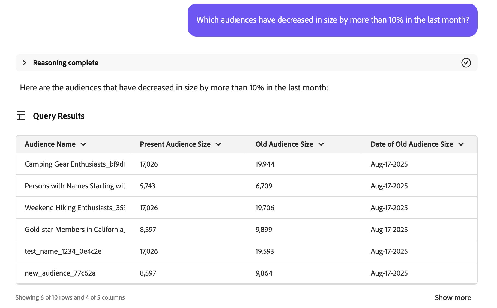
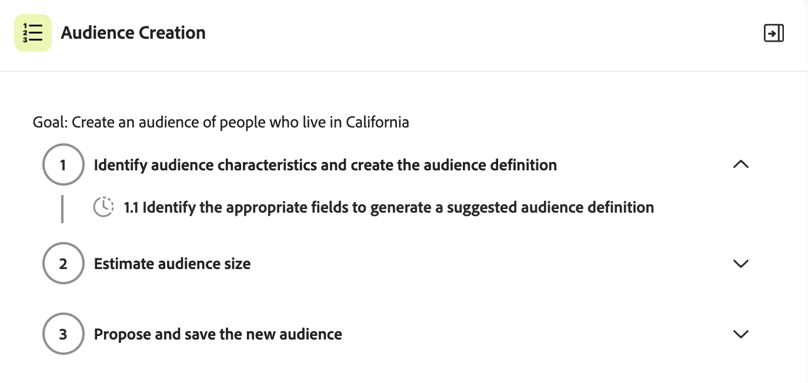
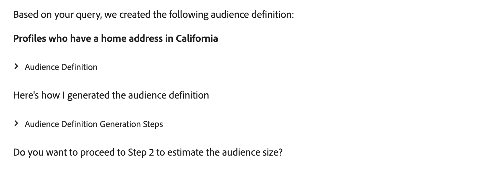
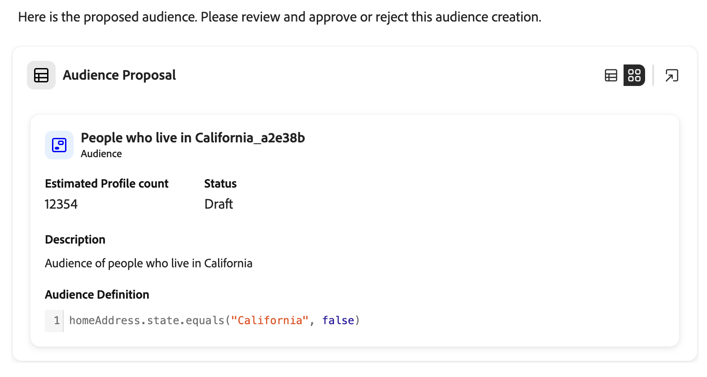

# Agent Audience

>[!AVAILABILITY]
>
>The Audience Agent is available for all customers who have access to AI Assistant. However, you will need the following permissions in order to fully use the Audience Agent features.
>
>**View Segments**: This permission lets you use the Audience Agent to view insights into the audiences directly in AI Assistant.
>
>**Manage Segments**: To permission lets you use the Audience Agent to create new audiences directly in AI Assistant.

The Audience Agent lets you view insights about audiences, including detecting significant audience size changes, detecting duplicate audiences, exploring your audience inventory, and retrieving your audiences&#39; size.

>[!SLIDE](audience-agent-overview)

## Cas d’utilisation pris en charge

The Audience Agent within AI Assistant supports the following use cases:

- Conversationally explore your audience
   - Find audience sizes of existing audiences
   - Look for audiences based on full or partial attributes named
   - Detect duplicate audiences
   - Discover XDM fields you can use to define an audience
- Détecter les modifications importantes de la taille de l’audience
   - This lets you find audiences that have suddenly grown or shrunk, letting you better analyze potential market changes
- Création d’une audience
   - This skill lets you create an audience based on the given attributes and events
   - Additionally, this skill lets you estimate the potential size of an audience prior to creating the audience, letting you quickly iterate on the most effective audience before it&#39;s ready to activate

<!--
  - Find your audience size and detect significant changes in audience size
  - This lets you find audiences that have suddenly grown or shrunk, letting you better analyze potential market changes
- Detect duplicate audiences
  - This lets you reduce redundancies with your created audiences
- Find audiences based on full or partial attributes named
  - This lets you more easily navigate through your audience inventory
- Discover XDM fields you can use to define an audience
  - This skill lets you more easily identify the right fields to use in your audience based on context and relevance 
-->

The Audience Agent does not **currently** support the following feature:

- Goal-based audience exploration
   - Goal-based audience exploration lets you discover relevant datasets and profiles aligned to a business goal by applying machine learning models such as propensity to buy or convert.

Additionally, when using Audience Agent, you should keep the following constraints in mind:

- Audience Agent needs at least 24 hours to process your data
   - For example, you **cannot** have a query that looks for data within the last 24 hours. You&#39;ll need to look within the last 48 hours, at a minimum.
- Audience Agent only supports the following audience types:
   - Audiences **basées sur les personnes** évaluées à l’aide de la segmentation par lots
   - Audiences **basées sur un compte** pour les cas d’utilisation suivants :
      - Exploration des audiences de conversation
      - Détection des doublons d’audience

## Exemples d’invites

Les exemples suivants présentent des exemples d’invites et de réponses pour Audience Agent.

### Exploration des audiences de conversation

Afficher les champs pour les acheteurs aisés.

+++ Réponse


+++

Quelles audiences n’ont été activées ou utilisées dans aucune campagne au cours des 30 derniers jours ?

+++ Réponse


+++

Répertoriez toutes les audiences qui ont été mappées à de nouvelles destinations au cours des 3 derniers mois.

+++ Réponse


+++

Quelle audience de compte a la plus grande taille d’audience et quelle est cette taille ?

+++ Réponse


+++

### Détecter les audiences en double

Existe-t-il des audiences avec des descriptions identiques ou similaires ?

+++ Réponse


+++

Identifiez les audiences qui ont les mêmes règles, mais des noms différents.

+++ Réponse


+++

Montrez-moi toutes les audiences qui ont les mêmes règles, mais des destinations d’activation différentes.

+++ Réponse


+++

Identifiez les audiences de compte qui ont les mêmes règles, mais des noms différents.

+++ Réponse


+++

### Récupérer la taille de l’audience

Quelle est la taille actuelle de mon audience « Membres Gold-star en Californie_f153e1 » ?

+++ Réponse


+++

Quel est mon public le plus important ?

+++ Réponse


+++

### Détecter les modifications importantes de la taille de l’audience

Quelles audiences ont augmenté leur taille de plus de 20 % au cours de la dernière semaine ?

+++ Réponse


+++

Quelles audiences ont vu leur taille diminuer de plus de 10 % au cours du dernier mois ?

+++ Réponse



+++

Quelle est mon audience qui croît le plus rapidement ?

+++ Réponse


+++

### Créer une audience

>[!AVAILABILITY]
>
>Vous ne pouvez utiliser la compétence de création d’audience que si vous faites partie du programme Explorateur Agent Orchestrator. Pour plus d’informations, contactez l’Assistance clientèle d’Adobe.

Lorsque vous créez une audience avec Audience Agent, l’assistant AI vous guide tout au long d’un plan. Par exemple, vous pouvez demander à « Créer une audience composée de personnes qui vivent en Californie ». L’assistant AI répertorie ensuite le plan qu’il entreprendra pour créer l’audience.

+++ Réponse


+++

Ce plan se compose de trois étapes :

1. [Identifier les caractéristiques de l’audience](#identify)
2. [Estimer la taille de l’audience](#estimate)
3. [Créer et conserver une nouvelle audience](#create)

#### Identifier les caractéristiques de l’audience {#identify}

{align="center" width="80%"}

After accepting the plan, AI Assistant will grab the audience&#39;s characteristics based off of your initial query.

+++ Réponse



For this query, AI Assistant generates the relevant Profile Query Language (PQL) that would look for people who live in California. In this use case, the PQL query would look like the following:

```sql
homeAddress.state.equals("California", false)
```

For more information on PQL, read the [PQL overview](https://experienceleague.adobe.com/fr/docs/experience-platform/segmentation/pql/overview).

+++

If the AI Assistant&#39;s audience definition is correct, you can approve and move on to the next step.

#### Estimer la taille de l’audience {#estimate}

{align="center" width="80%"}

After approving the identified audience characteristics, AI Assistant will estimate the size of the potential audience and the audience definition details.

+++ Réponse


+++

If the estimated size looks correct, you can approve and move on to the next step.

#### Create and persist new audience {#create}

{align="center" width="80%"}

Finally, if the characteristics and the audience size look correct, you can approve or reject the audience&#39;s creation.

+++ Réponse

First, you can review the proposed audience through the provided data grid.



If the audience looks correct, you can accept the proposal by selecting **[!UICONTROL Create]** to finish creating the audience.


+++

The audience is now created.

{align="center" width="80%"}

## Étapes suivantes

After reading this guide, you should have a better understanding of Audience Agent and what features it supports. For more information on agents in Adobe Experience Platform, read the [Agent Orchestrator overview](./agent-orchestrator.md).

