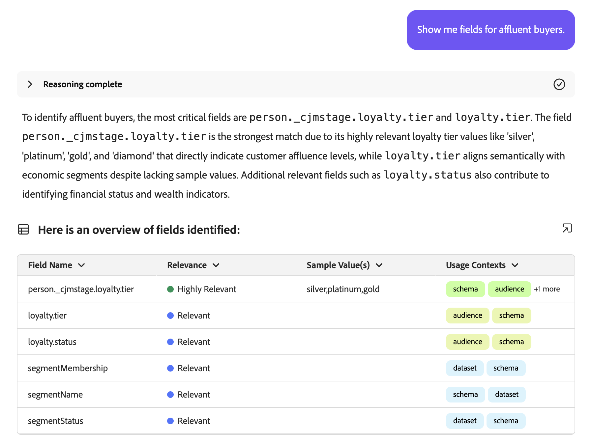

# Agent Audience

>[!AVAILABILITY]
>
>Audience Agent est disponible pour tous les clients qui ont accès à l’assistant AI. Toutefois, vous aurez besoin des autorisations suivantes pour utiliser pleinement les fonctionnalités d’Audience Agent.
>
>**Afficher les segments** : cette autorisation vous permet d’utiliser Audience Agent pour afficher des informations sur les audiences directement dans l’assistant AI.
>
>**Gérer les segments** : pour obtenir l’autorisation, vous pouvez utiliser Audience Agent afin de créer de nouvelles audiences directement dans l’assistant AI.

Audience Agent vous permet d’obtenir des informations sur les audiences, notamment la détection des modifications importantes de la taille de l’audience, la détection des audiences en double, l’exploration de votre inventaire des audiences et la récupération de la taille de vos audiences.

## Cas d’utilisation pris en charge

L’assistant Audience Agent within AI prend en charge les cas d’utilisation suivants :

- Rechercher la taille de l’audience et détecter les modifications importantes de cette dernière

   - Vous pouvez ainsi trouver des audiences qui ont soudainement augmenté ou diminué, ce qui vous permet de mieux analyser les changements potentiels du marché

- Détecter les audiences en double

   - Vous pouvez ainsi réduire les redondances avec les audiences que vous avez créées

- Rechercher des audiences en fonction d’attributs complets ou partiels nommés

   - Vous pouvez ainsi parcourir plus facilement votre inventaire d’audiences

- Découvrir les champs XDM que vous pouvez utiliser pour définir une audience

   - Cette compétence vous permet d’identifier plus facilement les champs à utiliser dans votre audience en fonction du contexte et de la pertinence

Audience Agent ne prend pas **actuellement** en charge les fonctionnalités suivantes :

- Création d’audiences basées sur les connaissances

   - La création d’une audience basée sur les connaissances consiste à créer une audience basée sur les attributs et les événements donnés
   - De plus, vous pouvez estimer la taille potentielle de l’audience avant la création de l’audience. Vous pouvez ainsi itérer rapidement sur l’audience la plus efficace avant qu’elle ne soit prête à être activée
   - La prise en charge de cette fonctionnalité sera bientôt disponible

- Exploration des audiences basée sur des objectifs

   - L’exploration des audiences basée sur des objectifs vous permet de découvrir des jeux de données et des profils pertinents alignés sur un objectif commercial en appliquant des modèles de machine learning tels que la propension à acheter ou à convertir.

En outre, lors de l’utilisation d’Audience Agent, vous devez tenir compte des contraintes suivantes :

- Audience Agent a besoin d’au moins 24 heures pour traiter vos données

   - Par exemple, vous **pouvez pas** une requête qui recherche des données au cours des dernières 24 heures. Vous devrez vérifier dans les 48 dernières heures, au minimum.

- Audience Agent ne prend en charge que les audiences basées sur les **personnes** qui sont évaluées à l’aide de la segmentation par lots

## Exemples d’invites

Les exemples suivants présentent des exemples d’invites et de réponses pour Audience Agent.

### Exploration des audiences de conversation

Afficher les champs pour les acheteurs aisés.

+++ Réponse

+++

Quelles audiences n’ont été activées ou utilisées dans aucune campagne au cours des 30 derniers jours ?

+++ Réponse

+++

Répertoriez toutes les audiences qui ont été mappées à de nouvelles destinations au cours des 3 derniers mois.

+++ Réponse

+++

### Détecter les audiences en double

Existe-t-il des audiences avec des descriptions identiques ou similaires ?

+++ Réponse

+++

Identifiez les audiences qui ont les mêmes règles, mais des noms différents.

+++ Réponse

+++

Montrez-moi toutes les audiences qui ont les mêmes règles, mais des destinations d’activation différentes.

+++ Réponse

+++

### Récupérer la taille de l’audience

Quelle est la taille actuelle de mon audience « Membres Gold-star en Californie_f153e1 » ?

+++ Réponse

+++

Quel est mon public le plus important ?

+++ Réponse

+++

### Détecter les modifications importantes de la taille de l’audience

Quelles audiences ont augmenté leur taille de plus de 20 % au cours de la dernière semaine ?

+++ Réponse

+++

Quelles audiences ont vu leur taille diminuer de plus de 10 % au cours du dernier mois ?

+++ Réponse

+++

Quelle est mon audience qui croît le plus rapidement ?

+++ Réponse

+++

## Étapes suivantes

Vous êtes arrivé au bout de ce guide, vous devriez mieux comprendre Audience Agent et les fonctionnalités qu’il prend en charge. Pour plus d’informations sur les agents dans Adobe Experience Platform, lisez la présentation d’[Agent Orchestrator](./agent-orchestrator.md).

