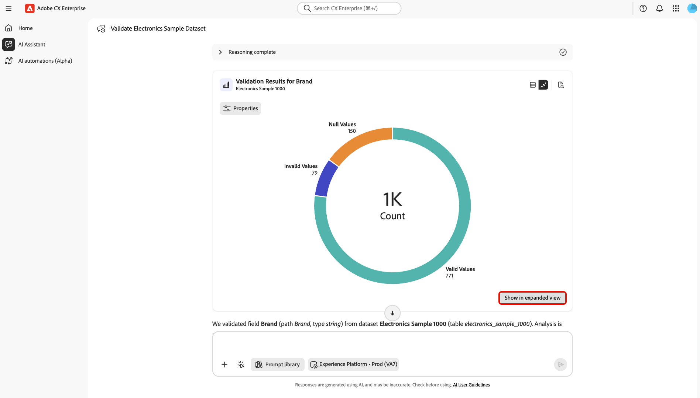

# Valider vos données dans l’assistant d’IA

Vous pouvez utiliser l’assistant AI pour valider la qualité des données de vos jeux de données Adobe Experience Platform. Optimisée par Agent Orchestrator, la fonctionnalité de validation des données peut effectuer des validations statistiques et sémantiques sur les jeux de données, analyser les champs des jeux de données, identifier les problèmes de qualité des données et renvoyer des résumés en langage naturel avec des informations exploitables. Les ingénieurs de données, les analystes et les gestionnaires de données peuvent utiliser cette fonctionnalité par le biais de l’assistant AI pour exécuter des évaluations rapides de la qualité des données sans écrire de requêtes SQL ou parcourir des hiérarchies de schémas complexes.

Grâce à la validation des données optimisée par Agent Orchestrator dans l’assistant AI, vous pouvez :

- Combler les lacunes essentielles à la fois dans le processus d’intégration et dans les diagnostics quotidiens.
- Réduisez le contrôle qualité manuel sur vos jeux de données.
- Accélérez le délai de rentabilisation pour vos clients.

Lisez cette documentation pour savoir comment valider vos données dans l’assistant AI.

>[!NOTE]
>
>L’assistant AI est l’interface de conversation de ce workflow. Agent Orchestrator effectue le raisonnement et coordonne les étapes de validation en arrière-plan.

## Cas d’utilisation

| Cas d’utilisation | Description |
| --- | --- |
| Nouvelle implémentation | Dans ces scénarios, vous pouvez valider les champs d’identité et d’événement clés afin de confirmer que les formats et les taux nuls ont l’air sains. |
| Problème de mappage suspecté | Dans ces scénarios, vous pouvez valider un champ et inspecter les valeurs principales et non valides pour confirmer qu’il correspond à la sémantique prévue. |
| Gestion continue des données | Dans ces scénarios, vous pouvez exécuter une validation de jeu de données sur des jeux de données critiques une fois par semaine pour détecter les régressions de manière précoce. |

## Guide de l’interface utilisateur du

Utilisez l’**assistant AI** dans Adobe CX Enterprise pour valider vos données. L’assistant AI est l’interface conversationnelle, tandis qu’Agent Orchestrator coordonne le workflow de validation en coulisses. Les étapes suivantes suivent les écrans principaux qui s’affichent.

### Démarrer la validation

Dans le volet de navigation de gauche, sélectionnez **[!UICONTROL Assistant IA]**. Ensuite, utilisez le sélecteur d’environnement et choisissez l’organisation Experience Platform ou le sandbox où réside votre jeu de données (par exemple, **[!UICONTROL Experience Platform - Prod]**). Dans le champ d’invite, saisissez une demande de validation (par exemple, demander à de valider un jeu de données par son nom). Sélectionnez **[!UICONTROL Envoyer]** pour envoyer l’invite.

>[!TIP]
>
>Il est recommandé de faire précéder les noms de vos jeux de données du mot « jeu de données » lors de l’envoi d’une requête à l’assistant AI. Par exemple, votre requête doit être « Valider l’échantillon électronique du jeu de données 1000 » au lieu de « Valider l’échantillon électronique 1000 ».

### Lire le tableau des champs et du résumé du jeu de données

Patientez quelques instants le temps qu’Agent Orchestrator termine l’exécution (**Raisonnement terminé**). Une fois l’exécution terminée, lisez le résumé relatif au nom du jeu de données, le nombre de champs validés et la taille de l’échantillon (généralement jusqu’à environ 1 000 lignes).

Utilisez la **[!UICONTROL Synthèses des champs]** pour consulter le chemin d’accès, le type et les valeurs valides de chaque champ (y compris l’indicateur de validité). De plus, vous pouvez utiliser les icônes de tableau, de graphique ou de document sur la carte pour modifier l’affichage des résultats, le cas échéant.

Sélectionnez **[!UICONTROL Afficher tous les résultats]** lorsque vous avez besoin de colonnes ou de lignes supplémentaires au-delà de la première vue.

### Travailler en mode partagé

En mode développé, utilisez la mise en page fractionnée : statistiques et narration détaillées d’un côté et graphique de l’autre.

- Du côté narratif, passez en revue la validité, les valeurs distinctes, les taux nuls, les principales valeurs distinctes et tous les messages de valeur non valide.
- Du côté de la visualisation, utilisez le graphique pour une lecture rapide des valeurs valides ou non valides dans l’exemple.

Utilisez **[!UICONTROL Suggestions associées]** ou le champ d’invite en bas pour valider un autre champ, réexécuter le jeu de données ou continuer la conversation.

### Utiliser une suggestion associée pour un suivi

Après une réponse, trouvez **[!UICONTROL Suggestions connexes]** sous la conversation. Sélectionnez une suggestion (par exemple, validez un champ spécifique sur le même jeu de données) pour le charger dans le champ d’invite. Ajustez le texte si nécessaire, confirmez l’environnement, puis sélectionnez **[!UICONTROL Envoyer]** pour exécuter la relance.

### Validation au niveau du champ

.

Ouvrez une vignette **[!UICONTROL Résultats de la validation]** au niveau du champ (par exemple, après la validation d’un seul champ). Utilisez les commandes d&#39;affichage pour passer à **Graphique** (ou à une autre vue) lorsque vous souhaitez un résumé visuel au lieu d&#39;un tableau. Au cours de cette étape, vous pouvez éventuellement sélectionner **[!UICONTROL Propriétés]** pour en savoir plus sur le champ.

Sélectionnez **[!UICONTROL Afficher en mode développé]** pour ouvrir une vue plus grande et plus détaillée de la validation de ce champ.

Grâce à la vue développée, vous pouvez afficher une liste détaillée de l’ensemble du champ, en fonction d’un échantillon de 1 000 enregistrements maximum pour le champ donné. Vous pouvez utiliser cette fonctionnalité pour récupérer des informations sur vos valeurs valides, distinctes et nulles.

## Fonctionnement de la validation

Lorsque vous lancez une validation dans l’assistant AI, Agent Orchestrator analyse un échantillon représentatif de votre jeu de données, généralement les 1 000 lignes les plus récentes, plutôt que de traiter l’ensemble de l’historique du jeu de données. Le processus est strictement en lecture seule, ce qui garantit que vos données, schémas et mappages restent inchangés. Les résultats de validation sont cohérents, quelle que soit la manière dont vos données entrent dans Experience Platform, que ce soit par le biais de sources, de diffusions en continu, de chargements de fichiers, de la préparation des données ou d’autres méthodes d’ingestion. Les résultats servent de contrôles indicatifs pour vous aider à identifier rapidement les modèles de qualité des données ou les problèmes potentiels, ce qui vous permet d’effectuer d’autres actions (telles que l’exploration avec Query Service) si nécessaire. Cette approche optimisée par Agent Orchestrator permet des évaluations rapides sans interrompre l’ingestion des données ni affecter les charges de travail de production.

## Résultats de la validation

Pour chaque champ validé, l’assistant AI affiche les résultats générés par le workflow de validation, notamment :

**Statistiques de base**

- Nombre total de lignes utilisées pour l’échantillon
- nullCount (et éventuellement % null)
- uniqueCount (le cas échéant)
- Valeurs uniques principales (par exemple, top 10) et leurs fréquences

**Validation sémantique**

- Liste des **valeurs non valides suspectées**
- Pour chaque valeur non valide, une **explication** (par exemple, « format d’e-mail non valide », « horodatage en dehors de la plage attendue »)

**Résumé en langage naturel**

- Un bref résumé narratif de la qualité du champ
- Actions suivantes suggérées, telles que « examiner le mappage pour le champ X », « envisager de supprimer le champ Y en raison d’un taux nul élevé » ou « renforcer la validation du format d’e-mail ».

| Aspect | Exemple de sortie |
| --- | --- |
| Exhaustivité | `nullCount = 9,532 (95.3%)` |
| Unicité | `uniqueCount = 3` |
| Valeurs principales | `"True" (255), "False" (243)` |
| Valeurs initiales | `"abc@, reason: "not a valid email address"` |

## Types de validation

Vous pouvez effectuer deux types de validation principaux avec l’assistant d’IA :

- **Validation de champ** : validation d’un champ spécifique dans un jeu de données.
- **Validation du jeu de données** : validez jusqu’à cinq (5) champs d’un jeu de données.

>[!BEGINTABS]

>[!TAB Validation de champ]

Utilisez la validation de champ dans l’assistant AI pour valider un champ spécifique dans un jeu de données donné. Cette compétence de validation fournit les éléments suivants :

- Nombre nul et nombre de valeurs uniques.
- Valeurs uniques principales et leurs fréquences correspondantes.
- Validation sémantique assistée par l’IA (capacité à détecter les valeurs non valides en fonction des métadonnées disponibles et des valeurs réelles des données).

Voici quelques exemples d’invites pour la validation d’un champ :

- Validez le champ d’e-mail dans le jeu de données Customers_2024.
- Validez le statut du champ pour le jeu de données customer_events_2024.
- Validez le champ person.address.city pour le jeu de données de données client.

>[!TAB Validation du jeu de données]

Utilisez la validation des jeux de données dans l’assistant AI pour valider des jeux de données entiers, en résumant la qualité globale et les problèmes clés. Bien que vous puissiez fournir ces champs explicitement, Agent Orchestrator peut également analyser le jeu de données et déterminer automatiquement les champs les plus pertinents. Cette compétence fournit le même type d’informations que la validation de champ, mais pour plusieurs champs ciblés. Vous pouvez valider jusqu’à cinq champs dans un jeu de données donné.

Voici quelques exemples d’invites pour la validation du jeu de données :

- Validez le jeu de données 2024 des données client.
- Valider les champs e-mail, téléphone pour Customers_2024.
- Résumez les paramètres firstName, lastName et bornDate pour les données client.
- Résumé du jeu de données 693012a4b8c98b09cea350bc.

>[!ENDTABS]

## Contrôles effectués par validation des données

Les types de validation suivants sont effectués pour chaque champ et jeu de données :

- **Contrôles d&#39;exhaustivité** : nombres et pourcentages nuls/manquants.
- **Contrôles de distribution** : valeurs uniques principales et leurs distributions, détection de cardinalité élevée.
- **Contrôles sémantiques ou schéma** : utilise le nom, le type et la description du champ XDM pour déterminer à quoi ressemble une « valide », puis signale les anomalies.
- **Vérifications tenant compte du type de données** (le cas échéant) :
   - E-mail : format et plausibilité du domaine
   - Téléphone : préparation au format (par exemple, E.164)
   - Dates/horodatages : intégrité de base du format (par exemple, ISO-8601)
- **Contrôles d’identité** (futurs/étendus) : unicité des champs d’identité candidats ou des clés composites.

Ces contrôles associent des statistiques déterministes à une validation sémantique assistée par LLM pour détecter les valeurs qui « semblent fausses » même lorsqu’elles correspondent techniquement au schéma.

## Limites

Avant de valider vos données, il est important de connaître quelques limites clés. Ces contraintes visent à équilibrer les performances avec les fonctionnalités. Elles permettent de définir des attentes concernant les types d’analyses et d’informations attendus.

- **Échantillonnage uniquement** : la validation fonctionne sur un échantillon du jeu de données (généralement les 1 000 dernières lignes) plutôt que sur le traitement de l’ensemble du jeu de données. Les analyses de jeux de données complets ne sont pas disponibles.
- **Limite du nombre de champs** : lors de la validation d’un jeu de données, l’agent analyse jusqu’à cinq champs par requête. Vous pouvez spécifier ces champs ou permettre à l’agent de les sélectionner automatiquement.
- **Sémantique probabiliste** : la détection de valeurs non valides repose en partie sur une inférence basée sur LLM, qui peut parfois ne pas détecter des erreurs subtiles ou marquer des valeurs limites.
- **Opération en lecture seule** : l’agent n’apporte aucune modification à vos données ou à son schéma. Il fournit des informations et met en évidence les problèmes potentiels, mais n’effectue pas de correctifs automatisés.

Si vos besoins de validation sont plus exhaustifs ou nécessitent l’application d’une logique commerciale complexe, pensez à compléter les résultats affichés dans l’assistant AI avec des outils supplémentaires tels que les validations Query Service ou Data Prep.
