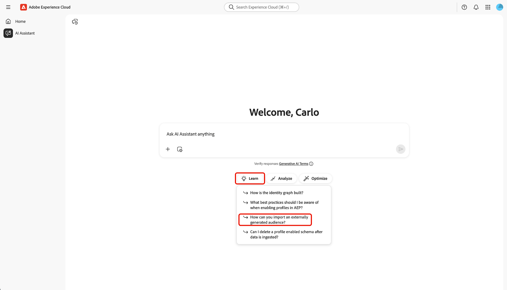
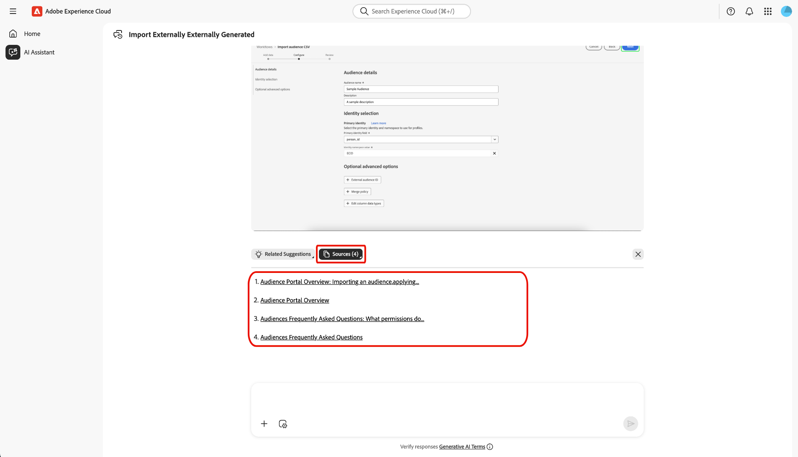
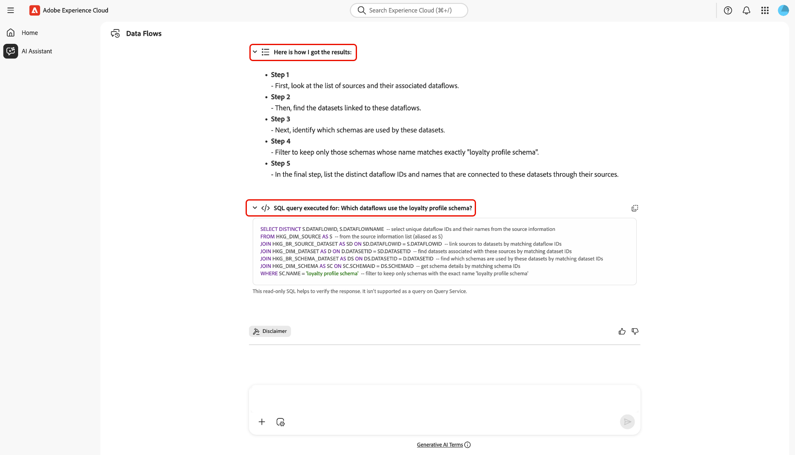

# Assistant IA

>[!IMPORTANT]
>
>This document applies to AI Assistant (Next-Gen). For information on AI Assistant (Legacy), read the [AI Assistant UI guide](https://experienceleague.adobe.com/fr/docs/experience-platform/ai-assistant/home) in the Adobe Experience Platform documentation.

Refer to the following table for a comparison of AI Assistant (Legacy) and AI Assistant (Next-Gen):

| Feature Area | AI Assistant (Legacy) | AI Assistant (Next-Gen) |
| --- | --- | --- |
| User experience | AI Assistant (Legacy) is available in a right-rail panel only. | AI Assistant (Next-Gen) is available in both right-rail panel and immersive full-screen experience. |
| Scope of capabilities | You can use AI Assistant (Legacy) for both product knowledge and operational insights. | You can use  AI Assistant (Next-Gen) for product knowledge, operational insights, as well as advanced agentic skills and multi-step task execution. |
| Platform architecture | AI Assistant (Legacy) is not built on the Agent Orchestrator stack. | AI Assistant (Next-Gen) is powered by [Adobe Experience Platform Agent Orchestrator](https://experienceleague.adobe.com/fr/docs/experience-cloud-ai/experience-cloud-ai/agents/agent-orchestrator), enabling extensibility and advanced coordination across capabilities. |
| Application coverage | AI Assistant (Legacy) is an application-specific implementation. | You can use AI Assistant (Next-Gen) for a unified AI Assistant experience across all Adobe Experience Cloud applications. |
| Access and permission model | Application-scoped access model aligned to individual product boundaries. | All users get access to AI Assistant (Next-Gen) and associated Experience Platform agents. **Note**: <ul><li>**Adobe Experience Manager**: Your administrator must grant you the permission to access AI Assistant (Next-Gen) through the [Adobe Admin Console](https://helpx.adobe.com/fr/enterprise/using/admin-console.html).</li><li>**Customer Journey Analytics**: Your administrator must grant you the permission to access AI Assistant through [Customer Journey Analytics Access Control](https://experienceleague.adobe.com/en/docs/analytics-platform/using/technotes/access-control?lang=en). Cela vous permet de poser des questions sur la connaissance des produits et les informations sur les données. |

AI Assistant est un outil d’IA conversationnel et génératif intelligent qui stimulera la productivité et redéfinira le travail dans les applications Adobe Experience Platform. Vous pouvez utiliser l’assistant AI pour accéder aux agents Adobe Experience Platform et à d’autres fonctionnalités d’IA.

Lisez ce guide pour savoir comment utiliser l’assistant AI.

>[!SLIDE](agent-orchestrator-ui)

## Accéder à l’assistant IA

Il existe plusieurs façons d’accéder à l’assistant AI.

Dans l’interface d’accueil d’Experience Cloud, sélectionnez **[!UICONTROL Assistant AI]** dans le volet de navigation de gauche pour lancer une vue plein écran de l’assistant AI.

+++Sélectionner pour afficher

+++

Vous pouvez également lancer l’assistant d’IA à partir des pages d’accueil d’applications Experience Cloud telles qu’Experience Platform, Adobe Journey Optimizer et Customer Journey Analytics. Accédez à la page d’accueil de votre produit, puis sélectionnez l’icône **Assistant AI** dans l’en-tête supérieur pour lancer le panneau de conversation de l’assistant AI sur le rail de droite.

+++Sélectionner pour afficher

+++

## Naviguer dans l’interface utilisateur de l’assistant d’IA

Lisez cette section pour savoir comment naviguer dans l’interface de l’assistant d’IA.

### Affichage plein écran

L’interface de l’assistant d’IA comprend plusieurs éléments clés pour vous aider à interagir efficacement :

1. **[!UICONTROL Conversations]** : sélectionnez l’icône **[!UICONTROL Conversations]** pour démarrer une nouvelle conversation et accéder aux conversations récentes à partir de votre historique. Pour plus d’informations, consultez la section sur les [conversations](#conversations).
2. **Zone de saisie** : sélectionnez la zone de saisie pour saisir les questions et les invites pour l’assistant IA. Pour plus d’informations, consultez la section sur les [fonctions d’entrée](#input-features).
3. **Saisie automatique des données et des objets** : sélectionnez l’icône plus pour utiliser les suggestions de données et d’objets et la saisie automatique. Lorsque cette option est sélectionnée, vous pouvez utiliser une fenêtre pop-up pour sélectionner les entités suggérées. Pour plus d’informations, consultez la section sur la [saisie automatique des données et des objets](#autocomplete).
4. **Paramètre de contexte** : sélectionnez l’icône Paramètre de contexte pour configurer des sources d’informations pour l’assistant AI. Vous pouvez utiliser cet outil pour configurer l’application, le sandbox et la vue de données auxquels l’assistant AI fait référence afin de répondre à votre requête. Pour plus d’informations, consultez la section sur [le paramètre contextuel](#context-setting).
5. **Discovery**: - Select **[!UICONTROL Learn]**, **[!UICONTROL Analyze]**, and **[!UICONTROL Optimize]** to view sample queries that you can use to get started. For more information, read the section on [discoverability prompts](#discoverability-prompts).

### Rail view

The rail view provides quick access to chat, discovery prompts, updates, conversations, and interface controls in a compact panel.

1. **[!UICONTROL Chat]**: Select **[!UICONTROL Chat]** from the header to return to your conversation in the event that you left to access different elements on the interface.
1. **[!UICONTROL Discovery]**: Select **[!UICONTROL Discovery]** to view a list of AI Assistant prompts organized by category. You can use these pre-configured prompts to populate your chat. Additionally, you can tweak the suggested prompts to meet your particular use case.
1. **[!UICONTROL What&#39;s New]**: Select **[!UICONTROL What&#39;s New]** to view a list of the latest updates available to AI Assistant.
1. **[!UICONTROL Conversations]** : sélectionnez l’icône **[!UICONTROL Conversations]** pour démarrer une nouvelle conversation et accéder aux conversations récentes à partir de votre historique. Pour plus d’informations, consultez la section sur les [conversations](#conversations).
1. **Full screen view**: Select the **[!UICONTROL Full screen view]** icon to change your AI Assistant interface from the right rail to full screen mode.
1. **Data and object autocomplete**: Select the plus icon to use data and object suggestion and autocomplete. Lorsque cette option est sélectionnée, vous pouvez utiliser une fenêtre pop-up pour sélectionner les entités suggérées. Pour plus d’informations, consultez la section sur la [saisie automatique des données et des objets](#autocomplete).
1. **Context setting**: Select the Context setting icon to configure information sources for AI Assistant. Vous pouvez utiliser cet outil pour configurer l’application, le sandbox et la vue de données auxquels l’assistant AI fait référence afin de répondre à votre requête. Pour plus d’informations, consultez la section sur [le paramètre contextuel](#context-setting).

## AI Assistant UI guide

This section provides an overview of the main features and navigation options in the AI Assistant user interface. It explains how to access AI Assistant, describes the layout and controls in both full screen and rail views, and introduces key tools such as conversations, input features, autocomplete, context setting, and discovery prompts. The following sections offer detailed guidance on using these features to interact with AI Assistant and get the most out of your experience.

### Discovery prompts {#discovery-prompts}

Vous pouvez utiliser la fonction de découverte de l&#39;assistant AI pour afficher une liste des sujets généraux, regroupés en entités, pris en charge par l&#39;assistant AI. Les invites de découverte sont différentes selon votre point de départ.

>[!BEGINTABS]

>[!TAB Utiliser la découverte à partir de l’affichage plein écran]

Dans l’affichage plein écran, les invites de découverte sont regroupées en trois catégories : **[!UICONTROL Apprendre]**, **[!UICONTROL Analyser]** et **[!UICONTROL Optimiser]**.

Pour utiliser les invites de découverte afin d’améliorer vos connaissances du produit, sélectionnez **[!UICONTROL En savoir]** puis sélectionnez une invite dans la fenêtre déroulante qui s’affiche.

>[!TAB Utiliser la découverte depuis la vue du rail]

Sélectionnez **[!UICONTROL Découverte]** dans la vue du rail pour accéder à une liste complète d’invites de découverte que vous pouvez utiliser pour commencer et remplir votre conversation avec l’assistant AI.

>[!ENDTABS]

Sélectionnez une invite pour remplir la zone de saisie. À partir de là, vous pouvez modifier l’invite en fonction de votre cas d’utilisation particulier. Une fois prêt, sélectionnez l’icône d’envoi à droite pour envoyer votre requête.

## Interagir avec les réponses

### Vérifier le processus de raisonnement {#reasoning}

L’assistant AI interroge ensuite sa base de connaissances et calcule une réponse. Après quelques instants, AI Assistant renvoie une réponse, y compris des options pour approfondir son processus de raisonnement, les suggestions associées, les sources d’information et les outils de commentaires.

Pour mieux comprendre le processus de raisonnement sous-jacent, sélectionnez **[!UICONTROL Raisonnement terminé]**.

La fenêtre *[!UICONTROL Raisonnement terminé]* s’agrandit pour afficher un résumé de votre demande et des détails sur la manière dont la réponse a été conçue.

### Utiliser les suggestions associées

Ensuite, naviguez jusqu’au bas de la réponse et sélectionnez **[!UICONTROL Suggestions associées]** pour recevoir une liste d’invites relatives à votre requête initiale. Vous pouvez utiliser ces invites pour continuer votre conversation avec l&#39;assistant AI.

### Afficher les sources

To verify AI Assistant&#39;s response, select **[!UICONTROL Sources]** to view a list of information sources that AI Assistant referenced when calculating its response.

### Fournir des commentaires

You can provide feedback of your experience with AI Assistant using the options provided with answer.

To provide feedback, select either thumbs up or thumbs down after receiving a response from AI Assistant, and then input your feedback in the provided text box.

>[!BEGINTABS]

>[!TAB Thumbs up]

Select **[!UICONTROL Thumbs up]** to provide positive feedback. You can optionally select from a list of positive feedback or use the input box to enter your own specific feedback.

+++Sélectionner pour afficher

You can also select **[!UICONTROL Detailed feedback]** to further elaborate on your feedback. Lorsque vous avez terminé, sélectionnez **[!UICONTROL Soumettre]**.

+++

>[!TAB Thumbs down]

Select **[!UICONTROL Thumbs down]** to provide constructive feedback. You can optionally select from a list of constructive feedback or use the input box to enter your own specific feedback.

+++Sélectionner pour afficher

Similarly, you can also select **[!UICONTROL Detailed feedback]** to further elaborate on your feedback. Lorsque vous avez terminé, sélectionnez **[!UICONTROL Soumettre]**.

+++

>[!ENDTABS]

### Use the split-view feature

If AI Assistant&#39;s response includes an image, you can select the path icon to launch a split-view mode. This allows you to read the entirety of AI Assistant&#39;s response with contextual image displayed on the right.

### Conversations

You can use the *[!UICONTROL All conversations]* panel to reset and revisit conversations with AI Assistant. Select the **[!UICONTROL Conversations]** icon to view the *[!UICONTROL All conversations]* window.

Pour revenir à une conversation précédente, sélectionnez le sujet de la conversation dans la liste fournie à cet effet.

Pour démarrer une nouvelle conversation, sélectionnez **[!UICONTROL Nouvelle conversation]**.

### Paramètre de contexte {#context-setting}

Utilisez la fonction de paramètre contextuel de l’assistant AI pour configurer les **application**, **sandbox** et **vue de données** auxquelles l’assistant AI fait référence pour répondre à votre requête. Pour accéder au paramètre contextuel, sélectionnez l’icône **[!UICONTROL Paramètre contextuel]** dans la zone de saisie.

La fenêtre pop-up *[!UICONTROL Réponse de...]* s’affiche. Utilisez cette fenêtre pour configurer les sources d&#39;informations à utiliser, puis sélectionnez **[!UICONTROL Définir le contexte]**.

| Source d&#39;information | Description | Exemples |
| --- | --- | --- |
| Application | Application Experience Cloud à laquelle votre requête se rapporte. | Experience Platform, Journey Optimizer, Customer Journey Analytics, etc. |
| Sandbox | Le sandbox qui contient le ou les jeux de données ou les informations auxquels votre requête se rapporte. | Prod (VA7), Dev. |
| Vue de données | Lorsque vous utilisez l’assistant AI avec Customer Journey Analytics, le paramètre de vue de données aide Data Insights Agent à comprendre les éléments suivants : <ul><li>Les jeux de données à interroger</li><li>Quels composants de données sont disponibles</li><li>Comment structurer les réponses sur vos données</li><li>Les visualisations à créer dans Analysis Workspace</li></ul> | |

### Saisie automatique des données et des objets

Vous pouvez utiliser la fonction de saisie semi-automatique pour recevoir une liste d’objets de données qui existent dans votre sandbox. Pour utiliser la saisie automatique, saisissez l’icône plus (+) dans votre requête. Vous pouvez également sélectionner l’icône plus (+) située au bas de la zone de saisie de texte. Une fenêtre s’affiche avec une liste des objets de données recommandés pour votre sandbox.

### Vérifier les réponses

Vous pouvez vérifier les réponses de l’assistant AI de différentes manières. Sélectionnez **[!UICONTROL Terme de la requête mis en correspondance avec des objets]** pour afficher un résumé des termes de votre requête qui ont été mis en correspondance avec des objets spécifiques de votre organisation.

Sélectionnez **[!UICONTROL Voici comment j’ai obtenu les résultats]** pour voir une explication détaillée et détaillée de la manière dont l’assistant AI est parvenu à sa réponse. De plus, vous pouvez également afficher la requête SQL qui a été exécutée pour répondre à votre question. Cette requête est en lecture seule et n’est pas prise en charge pour une utilisation dans Query Service.

### Configurer la visualisation des données

Vous pouvez utiliser les fonctionnalités de visualisation des données de l’assistant d’IA pour mieux comprendre vos données. Vous pouvez également spécifier le type de graphique à utiliser dans votre requête. Par exemple, envoyez une requête qui indique : **« Afficher les bénéfices par nom de produit pour le mois dernier (barre)«** pour recevoir un graphique à barres des bénéfices du mois dernier, organisé par nom de produit.

Sélectionnez ensuite **[!UICONTROL Propriétés]** pour modifier le type de graphique et configurer les valeurs des axes X et Y.

L’assistant AI prend en charge plusieurs types de graphiques pour la visualisation des données. Vous pouvez interagir avec tous les types de graphique en pointant sur les données.

>[!BEGINTABS]

>[!TAB Line]

Pour afficher un graphique linéaire, sélectionnez **[!UICONTROL Propriétés]** puis **[!UICONTROL Ligne]**.

>[!TAB Zone]

Pour afficher un graphique en aires, sélectionnez **[!UICONTROL Propriétés]** puis **[!UICONTROL Aires]**.

>[!TAB Scatter]

To view a scatter graph, select **[!UICONTROL Properties]** and then select **[!UICONTROL Scatter]**.

>[!TAB Anneau]

To view a donut graph, select **[!UICONTROL Properties]** and then select **[!UICONTROL Donut]**.

>[!ENDTABS]
