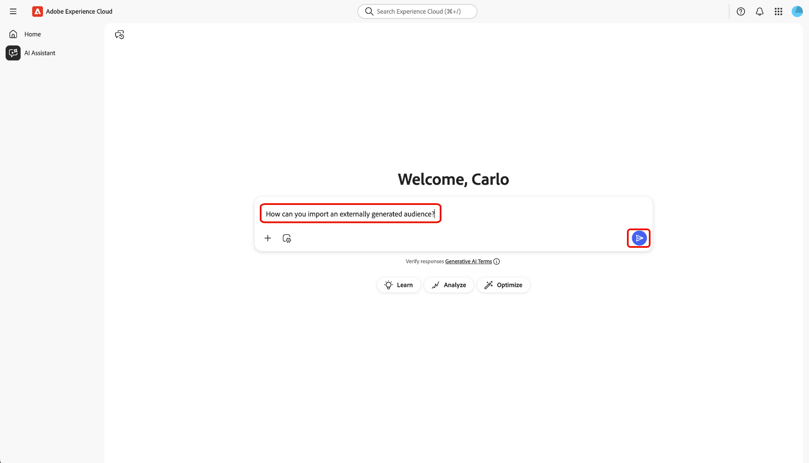
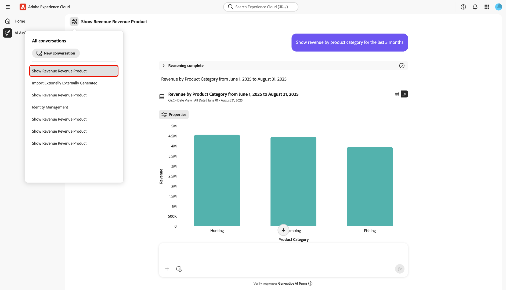
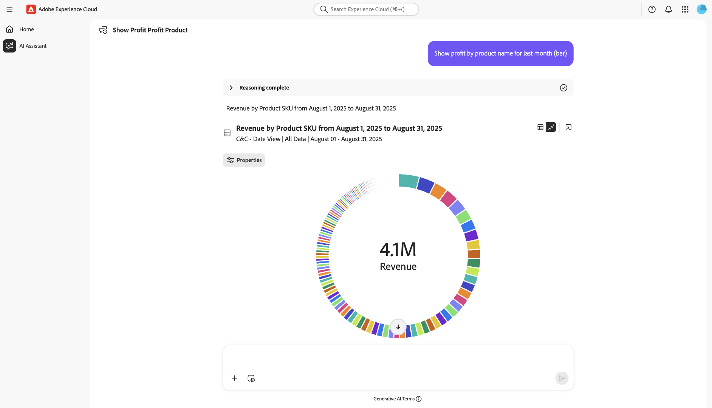

# Assistant IA

AI Assistant est un outil d’IA conversationnel et génératif intelligent qui stimulera la productivité et redéfinira le travail dans les applications Adobe Experience Platform. Vous pouvez utiliser l’assistant AI pour accéder aux agents Adobe Experience Platform et à d’autres fonctionnalités d’IA.

Lisez ce guide pour savoir comment utiliser l’assistant AI.

>[!SLIDE](agent-orchestrator-ui)

## Accéder à l’assistant IA

Il existe plusieurs façons d’accéder à l’assistant AI.

Dans l’interface d’accueil d’Experience Cloud, sélectionnez **[!UICONTROL Assistant AI]** dans le volet de navigation de gauche pour lancer une vue plein écran de l’assistant AI.

+++Sélectionner pour afficher

+++

Vous pouvez également lancer l’assistant d’IA à partir des pages d’accueil d’applications Experience Cloud telles qu’Experience Platform, Adobe Journey Optimizer et Customer Journey Analytics. Accédez à la page d’accueil de votre produit, puis sélectionnez l’icône **Assistant AI** dans l’en-tête supérieur pour lancer le panneau de conversation de l’assistant AI sur le rail de droite.

+++Sélectionner pour afficher

+++

## Naviguer dans l’interface utilisateur de l’assistant d’IA

Lisez cette section pour savoir comment naviguer dans l’interface de l’assistant d’IA.

### Affichage plein écran

L’interface de l’assistant d’IA comprend plusieurs éléments clés pour vous aider à interagir efficacement :

1. **[!UICONTROL Conversations]** : sélectionnez l’icône **[!UICONTROL Conversations]** pour démarrer une nouvelle conversation et accéder aux conversations récentes à partir de votre historique. Pour plus d’informations, consultez la section sur les [conversations](#conversations).
2. **Zone de saisie** : sélectionnez la zone de saisie pour saisir les questions et les invites pour l’assistant IA. Pour plus d’informations, consultez la section sur les [fonctions d’entrée](#input-features).
3. **Saisie automatique des données et des objets** : sélectionnez l’icône plus pour utiliser les suggestions de données et d’objets et la saisie automatique. Lorsque cette option est sélectionnée, vous pouvez utiliser une fenêtre pop-up pour sélectionner les entités suggérées. Pour plus d’informations, consultez la section sur la [saisie automatique des données et des objets](#autocomplete).
4. **Paramètre de contexte** : sélectionnez l’icône Paramètre de contexte pour configurer des sources d’informations pour l’assistant AI. Vous pouvez utiliser cet outil pour configurer l’application, le sandbox et la vue de données auxquels l’assistant AI fait référence afin de répondre à votre requête. Pour plus d’informations, consultez la section sur [le paramètre contextuel](#context-setting).
5. **Découverte** : sélectionnez **[!UICONTROL En savoir plus]**, **[!UICONTROL Analyser]** et **[!UICONTROL Optimiser]** pour afficher des exemples de requêtes que vous pouvez utiliser pour commencer. Pour plus d&#39;informations, lisez la section sur les [invites de visibilité](#discoverability-prompts).

### Vue du rail

La vue du rail permet d’accéder rapidement aux conversations, aux invites de découverte, aux mises à jour, aux conversations et aux commandes d’interface dans un panneau compact.

1. **[!UICONTROL Chat]** : sélectionnez **[!UICONTROL Chat]** dans l’en-tête pour revenir à votre conversation au cas où vous seriez parti pour accéder à différents éléments de l’interface.
1. **[!UICONTROL Découverte]** : sélectionnez **[!UICONTROL Découverte]** pour afficher la liste des invites de l’assistant AI organisées par catégorie. Vous pouvez utiliser ces invites préconfigurées pour renseigner votre chat. De plus, vous pouvez ajuster les invites suggérées pour répondre à votre cas d’utilisation particulier.
1. **[!UICONTROL Nouveautés]** : sélectionnez **[!UICONTROL Nouveautés]** pour afficher la liste des dernières mises à jour disponibles pour l’assistant AI.
1. **[!UICONTROL Conversations]** : sélectionnez l’icône **[!UICONTROL Conversations]** pour démarrer une nouvelle conversation et accéder aux conversations récentes à partir de votre historique. Pour plus d’informations, consultez la section sur les [conversations](#conversations).
1. **Affichage plein écran** : sélectionnez l’icône **[!UICONTROL Affichage plein écran]** pour passer de l’interface de l’assistant AI du rail de droite au mode Plein écran.
1. **Saisie automatique des données et des objets** : sélectionnez l’icône plus pour utiliser les données et la suggestion d’objet et la saisie automatique. Lorsque cette option est sélectionnée, vous pouvez utiliser une fenêtre pop-up pour sélectionner les entités suggérées. Pour plus d’informations, consultez la section sur la [saisie automatique des données et des objets](#autocomplete).
1. **Paramètre de contexte** : sélectionnez l’icône Paramètre de contexte pour configurer les sources d’informations pour l’assistant AI. Vous pouvez utiliser cet outil pour configurer l’application, le sandbox et la vue de données auxquels l’assistant AI fait référence afin de répondre à votre requête. Pour plus d’informations, consultez la section sur [le paramètre contextuel](#context-setting).

## Guide de l’interface utilisateur de l’assistant AI

Cette section présente les principales fonctionnalités et options de navigation de l’interface utilisateur de l’assistant AI. Il explique comment accéder à l’assistant d’IA, décrit la disposition et les contrôles dans les vues plein écran et rail et présente des outils clés tels que les conversations, les fonctionnalités de saisie, la saisie semi-automatique, le paramètre de contexte et les invites de découverte. Les sections suivantes fournissent des conseils détaillés sur l’utilisation de ces fonctionnalités pour interagir avec l’assistant AI et tirer le meilleur parti de votre expérience.

### Invites de découverte

Vous pouvez utiliser la fonction de découverte de l&#39;assistant AI pour afficher une liste des sujets généraux, regroupés en entités, pris en charge par l&#39;assistant AI. Les invites de découverte sont différentes selon votre point de départ.

>[!BEGINTABS]

>[!TAB Utiliser la découverte à partir de l’affichage plein écran]

Dans l’affichage plein écran, les invites de découverte sont regroupées en trois catégories : **[!UICONTROL Apprendre]**, **[!UICONTROL Analyser]** et **[!UICONTROL Optimiser]**.

Pour utiliser les invites de découverte afin d’améliorer vos connaissances du produit, sélectionnez **[!UICONTROL En savoir]** puis sélectionnez une invite dans la fenêtre déroulante qui s’affiche.

>[!TAB Utiliser la découverte depuis la vue du rail]

Sélectionnez **[!UICONTROL Découverte]** dans la vue du rail pour accéder à une liste complète d’invites de découverte que vous pouvez utiliser pour commencer et remplir votre conversation avec l’assistant AI.

>[!ENDTABS]

Sélectionnez une invite pour remplir la zone de saisie. À partir de là, vous pouvez modifier l’invite en fonction de votre cas d’utilisation particulier. Une fois prêt, sélectionnez l’icône d’envoi à droite pour envoyer votre requête.

## Interagir avec les réponses

### Vérifier le processus de raisonnement {#reasoning}

L’assistant AI interroge ensuite sa base de connaissances et calcule une réponse. Après quelques instants, AI Assistant renvoie une réponse, y compris des options pour approfondir son processus de raisonnement, les suggestions associées, les sources d’information et les outils de commentaires.

Pour mieux comprendre le processus de raisonnement sous-jacent, sélectionnez **[!UICONTROL Raisonnement terminé]**.

La fenêtre *[!UICONTROL Raisonnement terminé]* s’agrandit pour afficher un résumé de votre demande et des détails sur la manière dont la réponse a été conçue.

### Utiliser les suggestions associées

Ensuite, naviguez jusqu’au bas de la réponse et sélectionnez **[!UICONTROL Suggestions associées]** pour recevoir une liste d’invites relatives à votre requête initiale. Vous pouvez utiliser ces invites pour continuer votre conversation avec l&#39;assistant AI.

### Afficher les sources

Pour vérifier la réponse de l’assistant AI, sélectionnez **[!UICONTROL Sources]** pour afficher la liste des sources d’informations référencées par l’assistant AI lors du calcul de sa réponse.

### Fournir des commentaires

Vous pouvez fournir un retour d’expérience avec l’assistant d’IA à l’aide des options fournies avec la réponse.

Pour faire part de vos commentaires, sélectionnez l’une des options suivantes : pouces vers le haut ou pouces vers le bas, après avoir reçu une réponse de l’assistant AI, puis saisissez vos commentaires dans la zone de texte fournie.

>[!BEGINTABS]

>[!TAB Pouce vers le haut]

Sélectionnez **[!UICONTROL Pouces vers le haut]** pour fournir un retour positif. Vous pouvez éventuellement effectuer une sélection dans une liste de commentaires positifs ou utiliser la zone de saisie pour saisir vos propres commentaires.

+++Sélectionner pour afficher

Vous pouvez également sélectionner **[!UICONTROL Retour d’informations détaillé]** pour en savoir plus. Lorsque vous avez terminé, sélectionnez **[!UICONTROL Soumettre]**.

+++

>[!TAB Pouces vers le bas]

Sélectionnez **[!UICONTROL Pouces vers le bas]** pour fournir des commentaires constructifs. Vous pouvez éventuellement effectuer une sélection dans une liste de commentaires constructifs ou utiliser la zone de saisie pour saisir vos propres commentaires.

+++Sélectionner pour afficher

De même, vous pouvez également sélectionner **[!UICONTROL Commentaires détaillés]** pour développer davantage vos commentaires. Lorsque vous avez terminé, sélectionnez **[!UICONTROL Soumettre]**.

+++

>[!ENDTABS]

### Utilisation de la fonction de vue partagée

Si la réponse de l’assistant AI comprend une image, vous pouvez sélectionner l’icône de chemin d’accès pour lancer un mode d’affichage partagé. Vous pouvez ainsi lire l’intégralité de la réponse de l’assistant AI avec l’image contextuelle affichée à droite.

### Conversations

Vous pouvez utiliser le panneau *[!UICONTROL Toutes les conversations]* pour réinitialiser et revoir les conversations avec l’assistant d’IA. Sélectionnez l’icône **[!UICONTROL Conversations]** pour afficher la fenêtre *[!UICONTROL Toutes les conversations]*.

Pour revenir à une conversation précédente, sélectionnez le sujet de la conversation dans la liste fournie à cet effet.

Pour démarrer une nouvelle conversation, sélectionnez **[!UICONTROL Nouvelle conversation]**.

### Paramètre de contexte {#context-setting}

Utilisez la fonction de paramètre contextuel de l’assistant AI pour configurer les **application**, **sandbox** et **vue de données** auxquelles l’assistant AI fait référence pour répondre à votre requête. Pour accéder au paramètre contextuel, sélectionnez l’icône **[!UICONTROL Paramètre contextuel]** dans la zone de saisie.

La fenêtre pop-up *[!UICONTROL Réponse de...]* s’affiche. Utilisez cette fenêtre pour configurer les sources d&#39;informations à utiliser, puis sélectionnez **[!UICONTROL Définir le contexte]**.

| Source d&#39;information | Description | Exemples |
| --- | --- | --- |
| Application | Application Experience Cloud à laquelle votre requête se rapporte. | Experience Platform, Journey Optimizer, Customer Journey Analytics, etc. |
| Sandbox | Le sandbox qui contient le ou les jeux de données ou les informations auxquels votre requête se rapporte. | Prod (VA7), Dev. |
| Vue de données | Lorsque vous utilisez l’assistant AI avec Customer Journey Analytics, le paramètre de vue de données aide Data Insights Agent à comprendre les éléments suivants : <ul><li>Les jeux de données à interroger</li><li>Quels composants de données sont disponibles</li><li>Comment structurer les réponses sur vos données</li><li>Les visualisations à créer dans Analysis Workspace</li></ul> |

### Saisie automatique des données et des objets

Vous pouvez utiliser la fonction de saisie semi-automatique pour recevoir une liste d’objets de données qui existent dans votre sandbox. Pour utiliser la saisie automatique, saisissez l’icône plus (+) dans votre requête. Vous pouvez également sélectionner l’icône plus (+) située au bas de la zone de saisie de texte. Une fenêtre s’affiche avec une liste des objets de données recommandés pour votre sandbox.

### Vérifier les réponses

Vous pouvez vérifier les réponses de l’assistant AI de différentes manières. Sélectionnez **[!UICONTROL Terme de la requête mis en correspondance avec des objets]** pour afficher un résumé des termes de votre requête qui ont été mis en correspondance avec des objets spécifiques de votre organisation.

Sélectionnez **[!UICONTROL Voici comment j’ai obtenu les résultats]** pour voir une explication détaillée et détaillée de la manière dont l’assistant AI est parvenu à sa réponse. De plus, vous pouvez également afficher la requête SQL qui a été exécutée pour répondre à votre question. Cette requête est en lecture seule et n’est pas prise en charge pour une utilisation dans Query Service.

### Configurer la visualisation des données

Vous pouvez utiliser les fonctionnalités de visualisation des données de l’assistant d’IA pour mieux comprendre vos données. Vous pouvez également spécifier le type de graphique à utiliser dans votre requête. Par exemple, envoyez une requête qui indique : **« Afficher les bénéfices par nom de produit pour le mois dernier (barre) »** pour recevoir un graphique à barres des bénéfices du mois dernier, organisé par nom de produit.

Sélectionnez ensuite **[!UICONTROL Propriétés]** pour modifier le type de graphique et configurer les valeurs des axes X et Y.

L’assistant AI prend en charge plusieurs types de graphiques pour la visualisation des données. Vous pouvez interagir avec tous les types de graphique en pointant sur les données.

>[!BEGINTABS]

>[!TAB Line]

Pour afficher un graphique linéaire, sélectionnez **[!UICONTROL Propriétés]** puis **[!UICONTROL Ligne]**.

>[!TAB Zone]

Pour afficher un graphique en aires, sélectionnez **[!UICONTROL Propriétés]** puis **[!UICONTROL Aires]**.

>[!TAB Dispersion]

Pour afficher un graphique de dispersion, sélectionnez **[!UICONTROL Propriétés]** puis sélectionnez **[!UICONTROL Dispersion]**.

>[!TAB Anneau]

Pour afficher un graphique en anneau, sélectionnez **[!UICONTROL Propriétés]** puis **[!UICONTROL Anneau]**.

>[!ENDTABS]
